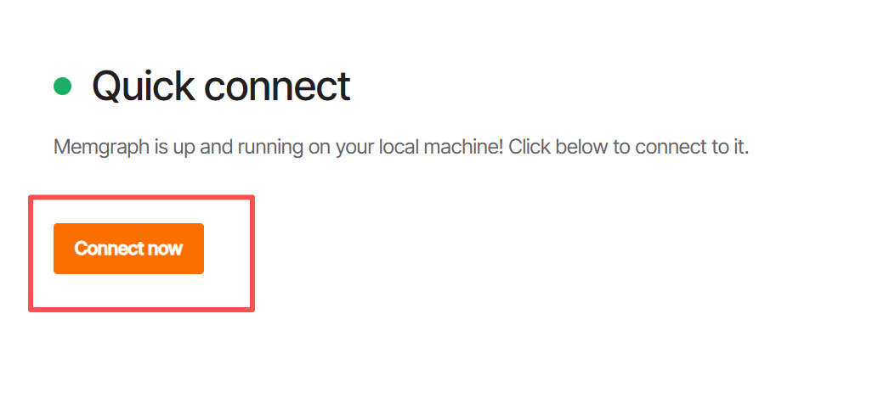
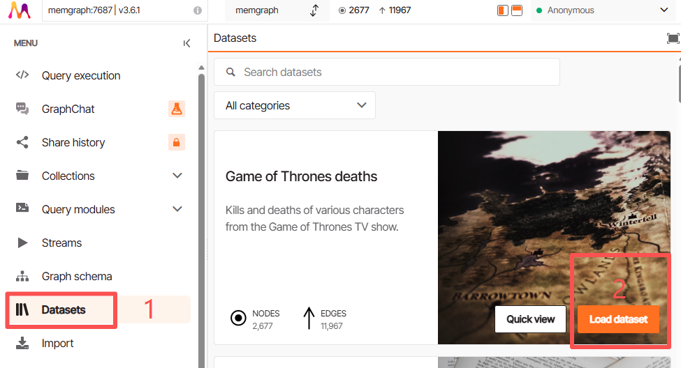
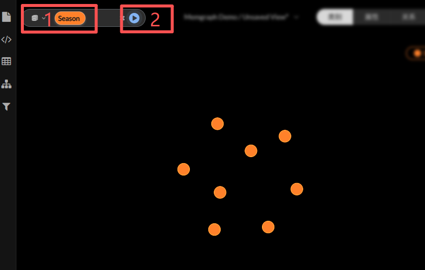

# GraphXR + Memgraph Docker Setup

Docker Compose configuration for running GraphXR and Memgraph graph database.

## 🚀 Quick Start

Download the [docker-compose.yaml](https://raw.githubusercontent.com/Kineviz/graphxr-lite/refs/heads/master/memgraph/docker-compose.yaml) file and run the following commands:

```bash
# Start all services
docker-compose up -d

# Check service status
docker-compose ps

# Stop services
docker-compose down
```

## 📖 Getting Started with Example Dataset

Follow these steps to load and explore the "Game of Thrones deaths" dataset:

1. **Open Memgraph Lab**  
   Navigate to http://localhost:8010

2. **Connect to Database**  
   Click the "Connect now" button  
   

3. **Load Example Dataset**  
   - Go to "Datasets" tab
   - Find "Game of Thrones deaths" dataset
   - Click "Load dataset" → Choose "Yes, Load the dataset"  
   
   - Wait for "Import successful" message and close the popup

4. **Explore in GraphXR**  
   - Navigate to http://localhost:8080
   - Login with credentials:
     - **Username**: graphxr@kineviz.com
     - **Password**: kineviz123456
   - Use the search function to query data (e.g., search for "Season")  
   
   - Enjoy exploring the interactive graph visualization!

## 📋 Service Information

### GraphXR
- **URL**: http://localhost:8080
- **Username**: graphxr@kineviz.com
- **Password**: kineviz123456

### Memgraph
- **Bolt Connection**: bolt://localhost:9687
- **Lab Interface**: http://localhost:8010
- **Database Name**: memgraph


## 📚 Related Links

- [Memgraph Documentation](https://memgraph.com/docs)
- [GraphXR Documentation](https://helpcenter.kineviz.com)
- [GraphXR Support](https://www.kineviz.com/contact)
