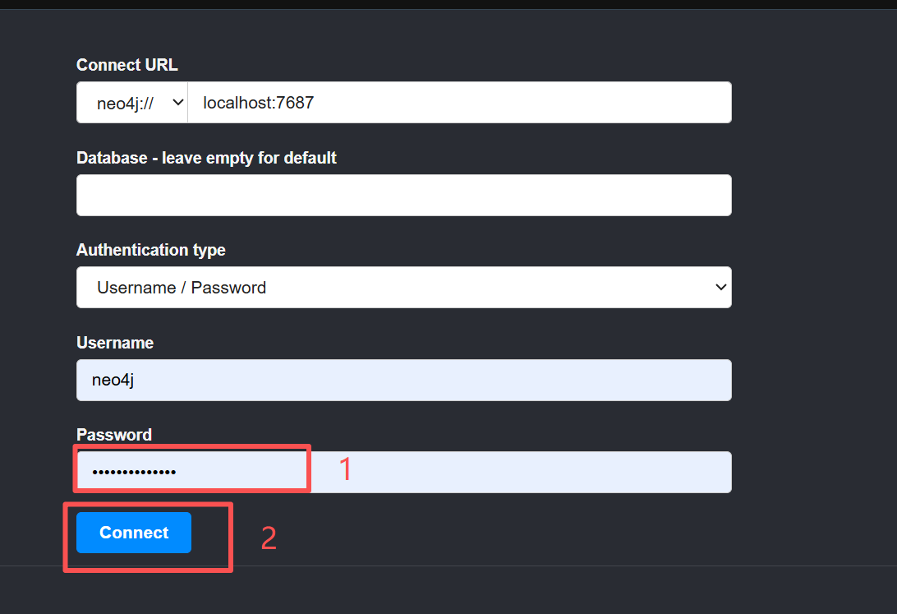
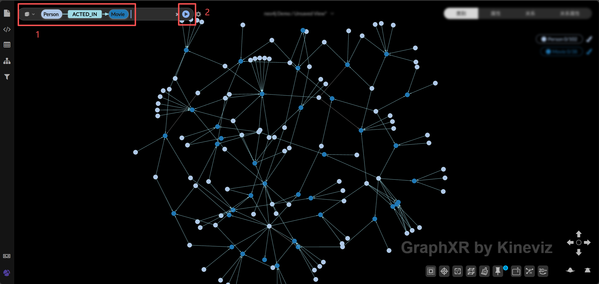

# GraphXR + Neo4j Docker Setup

A complete Docker Compose stack for running GraphXR with Neo4j graph database, featuring sample datasets for graph visualization and analysis.

## 📋 Table of Contents

- [Quick Start](#quick-start)
- [Getting Started](#getting-started)
- [Service Information](#service-information)
- [Related Links](#related-links)


## 🚀 Quick Start

```bash
# Clone and start
git clone https://github.com/Kineviz/graphxr-lite.git
cd graphxr-lite/neo4j
docker-compose up -d

# Check status
docker-compose ps

# Stop services
docker-compose down
```

## 📖 Getting Started

### 1. Access Neo4j Browser

Navigate to http://localhost:7474 and connect with:
- **Username**: `neo4j`
- **Password**: `kineviz123456`



### 2. Load Sample Data

In Neo4j Browser, load the Movie Graph example dataset.


### 3. Explore in GraphXR

Navigate to http://localhost:8080 and login:
- **Username**: `graphxr@kineviz.com`
- **Password**: `kineviz123456`

Search for "Person" or "Movie" to visualize the graph.



## 📋 Service Information

| Service | URL | Username | Password |
|---------|-----|----------|----------|
| GraphXR | http://localhost:8080 | graphxr@kineviz.com | kineviz123456 |
| Neo4j Browser | http://localhost:7474 | neo4j | kineviz123456 |
| Neo4j Bolt | bolt://localhost:7687 | neo4j | kineviz123456 |


## 📚 Related Links

- [Neo4j Documentation](https://neo4j.com/docs/)
- [GraphXR Documentation](https://helpcenter.kineviz.com)
- [GraphXR Support](https://www.kineviz.com/contact)
