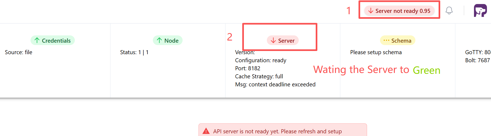
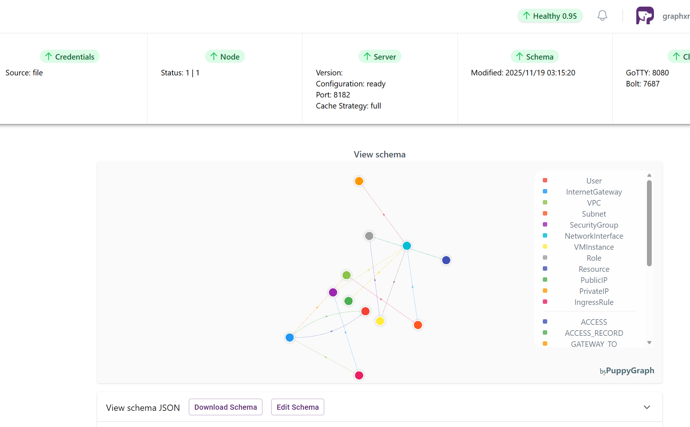
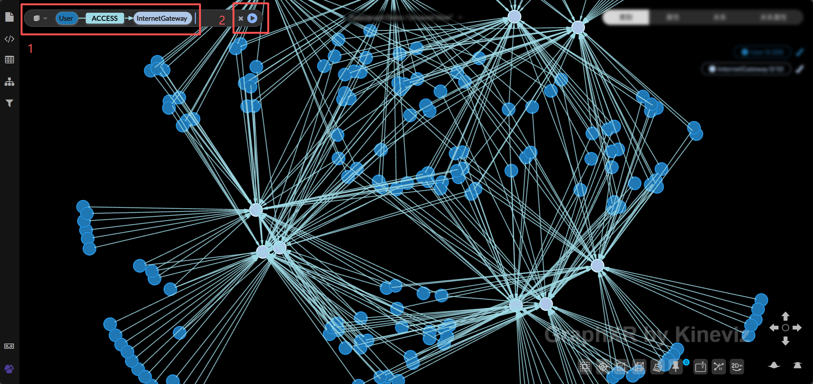

# GraphXR + PuppyGraph Docker Setup

A complete Docker Compose stack for running GraphXR with PuppyGraph, featuring Apache Iceberg, Spark, and MinIO for cloud security graph analysis.

## 📋 Table of Contents

- [Overview](#overview)
- [Quick Start](#quick-start)
- [Getting Started Guide](#getting-started-guide)
- [Service Information](#service-information)
- [Troubleshooting](#troubleshooting)
- [Related Links](#related-links)

## 🎯 Overview

This setup provides a production-ready environment for graph visualization and analysis, combining:

- **PuppyGraph**: Query engine for graph analytics over Apache Iceberg tables
- **GraphXR**: Interactive graph visualization and exploration interface
- **Apache Spark + Iceberg**: Distributed data processing and table format
- **MinIO**: S3-compatible object storage for data lake
- **MongoDB**: Metadata storage for GraphXR

The included demo dataset is based on the [PuppyGraph Cloud Security Use Case](https://github.com/puppygraph/puppygraph-getting-started/tree/main/use-case-demos/cloud-security-graph-demo), demonstrating cloud infrastructure security graph analysis.


## 🚀 Quick Start

** Clone the entire repository**

```bash
git clone https://github.com/Kineviz/graphxr-lite.git
cd graphxr-lite/puppygraph
docker-compose up -d
```


# Start services

```bash
docker-compose up -d
```

**Check service status:**

```bash
# View running containers
docker-compose ps

# View logs
docker-compose logs -f

# Stop all services
docker-compose down
```

## 📖 Getting Started Guide


### Step 1: Access PuppyGraph 

1). **Open PuppyGraph **  
   Navigate to http://localhost:9081

2). **Login to PuppyGraph**  
   Use the following credentials:
   - **Username**: `graphxr@kineviz.com`
   - **Password**: `kineviz123456`

3). **Wait for Server Ready**  
   After login, wait until the server status shows "Ready" (typically 10-30 seconds)
   
   

4). **Upload Schema (if prompted)**  
   If you see a message requesting schema upload:
   - Download [schema.json](https://raw.githubusercontent.com/Kineviz/graphxr-lite/master/puppygraph/schema.json)
   - Click the upload button and select the `schema.json` file
   
   

5). **Verify Schema Loaded**  
   Once ready, you should see the cloud security graph schema with nodes like Users, VPCs, Subnets, etc.
   
   

### Step 2: Explore in GraphXR

1). **Open GraphXR Interface**  
   Navigate to http://localhost:8080

2). **Login to GraphXR**  
   - **Username**: `graphxr@kineviz.com`
   - **Password**: `kineviz123456`

3). **Explore in GraphXR**  
   - Use the search panel to query nodes (e.g., search for "User")
   - Enjoy exploring the interactive graph visualization!

   


## 📋 Service Information

### GraphXR
- **Web Interface**: http://localhost:8080
- **Credentials**: 
  - Username: `graphxr@kineviz.com`
  - Password: `kineviz123456`
- **Purpose**: Interactive graph visualization and exploration

### PuppyGraph
- **Web Console**: http://localhost:9081
- **Bolt Protocol**: `bolt://localhost:9678`
- **Gremlin Endpoint**: `http://localhost:8182`
- **Credentials**:
  - Username: `graphxr@kineviz.com`
  - Password: `kineviz123456`
- **Purpose**: Graph query engine over Iceberg tables

### Apache Spark + Iceberg
- **Jupyter Notebook**: http://localhost:9888
- **Notebook Token**: `kineviz123456`
- **Purpose**: Data processing and Iceberg table management

### MinIO (S3 Storage)
- **Web Console**: http://localhost:9900
- **API Endpoint**: http://localhost:9900
- **Credentials**:
  - Access Key: `admin`
  - Secret Key: `password`
- **Purpose**: Object storage for Iceberg data warehouse

### Iceberg REST Catalog
- **API Endpoint**: http://localhost:8181
- **Purpose**: Metadata catalog for Iceberg tables

### MongoDB
- **Internal Port**: 27017
- **Purpose**: GraphXR metadata storage

## 🔧 Data Initialization

The setup includes automatic data initialization through the `init-data.sql` script, which creates:

### Database Schema: `security_graph`

**Vertex Tables:**
- `Users` - System users and their authentication details
- `InternetGateways` - Network internet gateways
- `VPCs` - Virtual Private Clouds
- `Subnets` - Network subnets
- `SecurityGroups` - Firewall rule groups
- `NetworkInterfaces` - Network interface cards
- `VMInstances` - Virtual machine instances
- `Roles` - IAM roles and permissions
- `Resources` - Cloud resources
- `PublicIPs` & `PrivateIPs` - IP address assignments

**Edge Tables:**
- `UserInternetGatewayAccess` - User access to gateways
- `UserInternetGatewayAccessLog` - Access audit logs
- `InternetGatewayVPC` - Gateway-VPC associations
- `SubnetSecurityGroup` - Subnet security group assignments
- `RoleResourceAccess` - Role-based resource access

### Custom Initialization

To modify the data schema or add your own data:

1. Edit `init/init-data.sql` with your custom SQL statements
2. Restart the Spark container: `docker-compose restart spark-iceberg`
3. Check logs: `docker logs spark-iceberg -f`

## 🔍 Troubleshooting

### Services not starting

```bash
# Check if ports are already in use
netstat -an | findstr "8080 8181 9081 9678 9888 9900"

# View detailed logs
docker-compose logs
```

### PuppyGraph schema not loading

1. Ensure Spark initialization completed successfully:
   ```bash
   docker logs spark-iceberg | findstr "successfully"
   ```

2. Verify Iceberg tables exist:
   - Access Jupyter: http://localhost:9888 (token: `kineviz123456`)
   - Run: `spark.sql("SHOW TABLES IN security_graph").show()`

3. Manually upload `schema.json` in PuppyGraph console

### GraphXR connection issues

1. Verify PuppyGraph is running:
   ```bash
   docker-compose ps puppygraph
   ```

2. Check GraphXR can reach PuppyGraph:
   ```bash
   docker exec graphxr ping puppygraph
   ```

3. Restart GraphXR container:
   ```bash
   docker-compose restart graphxr
   ```

### Reset everything

```bash
# Stop all services
docker-compose down

# Remove all data volumes (WARNING: deletes all data)
docker-compose down -v

# Start fresh
docker-compose up -d
```

## 📚 Related Links

### Documentation
- [PuppyGraph Documentation](https://docs.puppygraph.com/)
- [GraphXR Help Center](https://helpcenter.kineviz.com)
- [Apache Iceberg Documentation](https://iceberg.apache.org/docs/latest/)
- [Docker Compose Documentation](https://docs.docker.com/compose/)

### Related Projects
- [Cloud Security Graph Demo](https://github.com/puppygraph/puppygraph-getting-started/tree/main/use-case-demos/cloud-security-graph-demo)
- [GraphXR Examples](https://www.kineviz.com/resources)

### Support
- [GraphXR Support](https://www.kineviz.com/contact)
- [PuppyGraph Community](https://puppygraph.com/community)

---

**Note**: This is a development and demonstration environment. For production deployments, please implement appropriate security measures including:
- Strong passwords and authentication
- Network isolation and firewalls
- SSL/TLS encryption
- Regular security updates
- Backup and disaster recovery procedures
